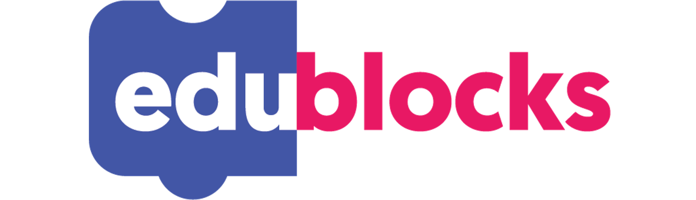
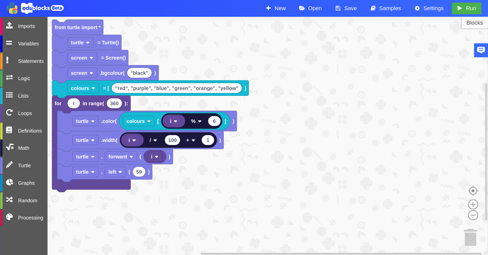

Welcome to the EduBlocks Github Repository!
===========================================

About EduBlocks
---------------
EduBlocks is a visual block based programming tool that helps teachers to introduce text based programming languages, like Python, to children at an earlier age via a drag and drop programming experience

EduBlocks is the easiest way to make the transition from blocks to text, here's why:

* Text on the blocks:
EduBlocks displays the Python text on the block so you can see exactly what you're coding.

* Python view:
The main part of EduBlocks is the visual block editor but once you've completed your block code, you can switch straight to a Python editor.

* Cross-Platform:
You can code on any device with the Web Python mode and program microcontrollers with your PC, Mac & Raspberry Pi.

* Modal Editor:
EduBlocks is a modal editor. Whatever you want to create a project with, it's all in one place.

* Designed with education in mind
EduBlocks hosts a number of resources to help students and teachers get started quickly.

* Everything is free!
EduBlocks and it's resources are all free and open source and we're commited to keeping it that way. We want to make sure EduBlocks can be accessed by all.

EduBlocks has many different "modes" that can be used with external hardware or just in the browser. Modes include:

- Python 3
- BBC micro:bit
- Raspberry Pi
- CircuitPython

### The editor can be found at [https://app.edublocks.org](https://app.edublocks.org)

Status
---------------
### Build Status

Developer Instructions
----------------------

NOTE: Windows users will need to enable symbolic link support before they attempt to clone the repository!

### Dependencies

Install Node.JS 6.10.3 using the appropriate installer for your platform. For Linux and Mac OS X (and also Bash on Windows), we recommend using NVM for this.

Install Yarn:

    npm --global install yarn

### Running Server and Client locally in developer mode on your PC

Developer mode allows you to run EduBlocks on your PC and watch for live code changes for developer convenience.

Open two terminal windows/tabs.

In the first terminal, run the UI watcher:

    cd ui
    yarn
    yarn run watch

In the second terminal, run the server:

    cd server
    yarn
    yarn run watch

Alternatively, you can install TMUX and run:

    tools/dev-start-sh

EduBlocks UI will now be available at http://localhost:8081/

#### Linux Install Instructions:

    sudo apt install git build-essential
    curl -o- https://raw.githubusercontent.com/creationix/nvm/v0.33.2/install.sh | bash
    . ~/.nvm/nvm.sh
    nvm install 6.10.3
    npm --global install yarn

    git clone git@github.com:AllAboutCode/EduBlocks/

    cd EduBlocks
    cd ui

    yarn
    yarn run build

    cd ../server
    yarn

    cd ..
    tools/dev-start.sh

### Building the EduBlocks tarball

The tarball is built using a shell script. This will create the subdirectory `edublocks`. The build script is only intended to be run by the CI platform however it will probably work on most Linux platforms.

To run build script:

    ./tarball-create.sh

Support
-------

Need help or support with EduBlocks? There are a few ways in which you can get in touch with us. We try our best to provide a speedy and smooth support service for our users. It may take us a few hours to respond as EduBlocks is not our full time jobs/ commitment. Also, it may take a few days/weeks/months before your request is solved.

### Twitter

EduBlocks Support: @edu_blocks
 
All About Code: @all_about_code

### Email

Email: josh@edublocks.org

### Website

EduBlocks: http://edublocks.org

Ways to contribute
-----------

We want to make EduBlocks a community project. We are open to people opening issues, giving us feedback on how we can improve and opening pull requests to add features or fixes to the project. The community plays a huge part in EduBlocks.

